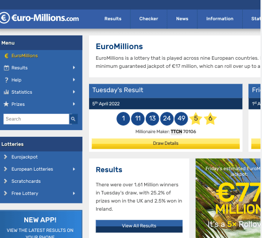
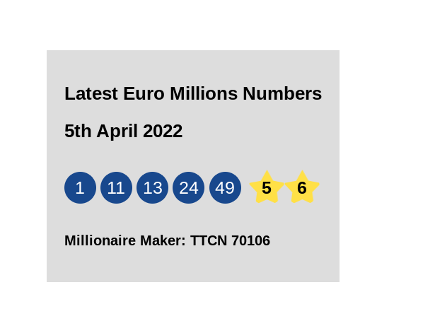

# Cheerio Scraper

Simple project to check out cheerio and web scraping.  

## Table of contents

- [Overview](#overview)
  - [Screenshot](#screenshot)
- [My process](#my-process)
  - [Built with](#built-with)
  - [What I learned](#what-i-learned)
  - [Useful resources](#useful-resources)

## Overview

### Screenshot

## My process

### Built with

- Express Generator
- Cheerio
- EJS

### What I learned

- Cheerio uses a jquery like syntax.  
- Web scraping is simple as requesting a webpage and then looking thru the html source code for the data you need. 
- You can't scrape dynamic content with cheerio. 
- Need others tools like Puppeteer, Playwright, or Selenium.  
- The [tutorial](https://www.youtube.com/watch?v=chYMIRJP8a0) I watched had some issues with the html code - skipping heading levels, etc - and other slight issues but it gave me enough to replicate something similar.  Didn't really need a separate frontend section so I used ejs.  
- To scrape powerball and mega million numbers need to use the other tools.  The numbers are set with javascript and the numbers' divs have no text content.  

### Useful resources

- [Euro Millions](https://www.euro-millions.com/)
- [YouTube](https://www.youtube.com/watch?v=chYMIRJP8a0) - web scraper with express tutorial
- [Stack Overflow](https://stackoverflow.com/questions/13788314/express-and-ejs-to-render-a-json) - ejs and render json
- [Stack Overflow](https://stackoverflow.com/questions/13260487/does-ejs-handle-array-mapcallback) - ejs map
- [Codepen](https://codepen.io/fxm90/pen/yOBWVe) - CSS star shape